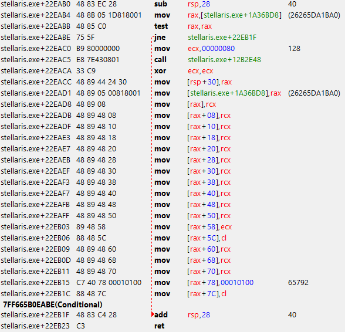

### Introduction

Stellaris has two conditions that needs to be met in order to receive achievements while playing the game: a valid checksum and Ironman mode enabled; I'm going to focus on the first condition.

The game decides to allow achievements only if the checksum computed from all his files related to gameplay elements (and thus to achievements), including the overrides performed by mods, is the same as a predetermined one, corresponding to a clean, vanilla installation of the game. This means that most mods, even those that in no way make it easier to get achievements, disable achievements completely. So I decided to see if I could reverse engineer the game executable to circumnvent this limitation.

### Reverse engineering

As a starting point, I searched for the string "achievement" in the list of referenced strings. I got 4 results, and one of them looked very promising: it was near "ACHIEVEMENT_ELIGIBLE" and "ACHIEVEMENT_NOT_ELIGIBLE" strings, which could be the Ids for the "This game is [not] eligible for achievements" message that appears on the new game configuration screen.

If the game makes a choice for which message to show, there must be a **cmp** or **test** somewhere in the code nearby, and in fact there were some **cmp** instructions right above.

All of the **cmp** instructions have a related jump that either sets **bl** to 1 (mov bl, 01) or to 0 (xor bl, bl), and that same **bl** (which is the first byte of the **rbx** register in x64) is later tested to see whether achievements are enabled or not, so I was on the right track.

The first **cmp** instruction pointer content (cmp byte ptr [rcx+000000AD], 00) is taken from a static address (stellaris.exe+1A34EB0), with two offsets (828 and AD), suggesting that this is a global structure in the game. I suspected this could be a flag indicating if Ironman mode is active or not, and monitoring this memory address while changing the Ironman settings on and off confirmed this hypothesis.

After the Ironman check there's a call to a function and a bunch of **cmp** on the **eax** register (which contains the value returned by that function). It seems there are three flags related to the checksum ([eax+7B], [eax+7A], [eax+79]). 

[eax+79] is always set to 1 and doesn't seem important, since the check still depends on the other two offsets.

[eax+7B] is always set to 0 and I couldn't figure out it's real purpose in the game; if it's set to 1 the game skips checking on the +7A flag (in that specific part of the code), and when forcing it to 1 the game showed a "This game is eligible for achievements" message, yet achievements were still not unlocking.

Forcing [rax+7A] to 1 proved to be more successful, as achievements were being unlocked this way, so I focused on this offset.

To find the real address of [eax+7A] I looked inside the call above the *cmp* instructions, too see what is put inside that register.

Luckily there's another static address (mov rax, [stellaris.exe+1A36BD8]), so the complete address is [stellaris.exe+1A36BD8+7A]. We can also see that the structure is returned as it is, unless it's not initialized (test rax, rax); in that case it's returned with +79 set to 1, +7A set to 1 and +7B set to 0 (mov [rax+78], 00010100).

After finding the address, I looked for all the places in the code that wrote to that address, to see where it was being set to 0.

After attaching the debugger to the Stellaris process, I found that that address was being written to only at game startup (mov [stellaris.exe+1A36BD8], rax), confirming my hypothesis that checksum is computed only once and it's validity is cached on that flag. The byte at 7A is initally set to 1, and then it gets changed to 0 (mov byte ptr [rbx+7A], 00). By changing that 00 to 01, the flag at 7A remains active for all the game runtime, allowing the player to unlock achievements even with an invalid checksum. 

### Conclusion
At the end, all it was necessary to do was to change a single bit in a 28MB executable
